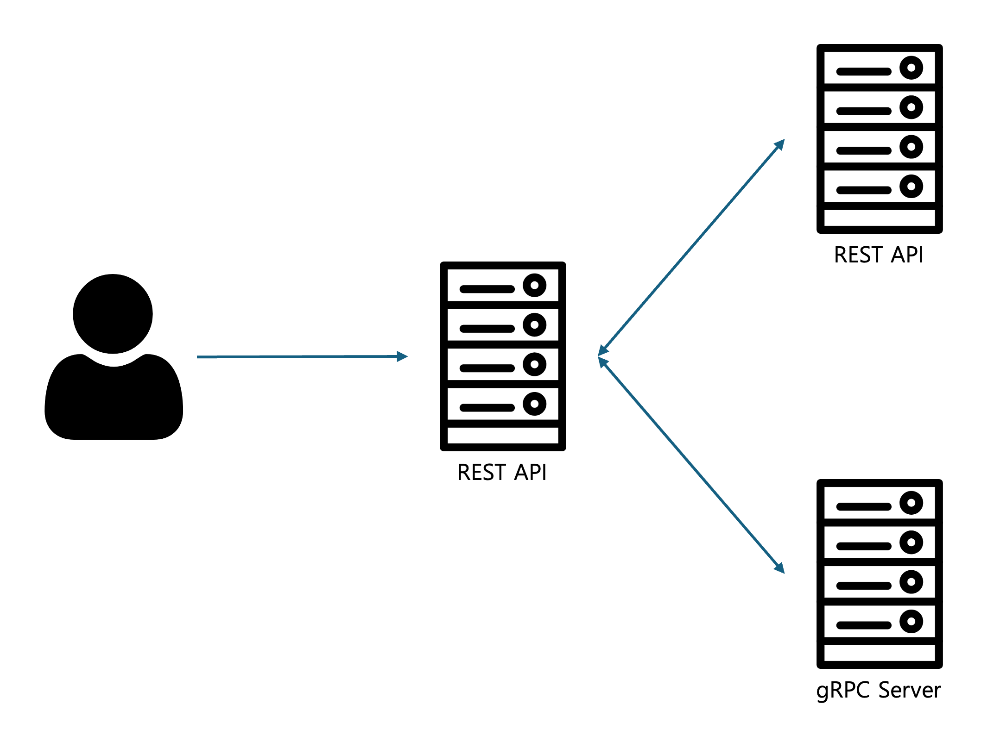
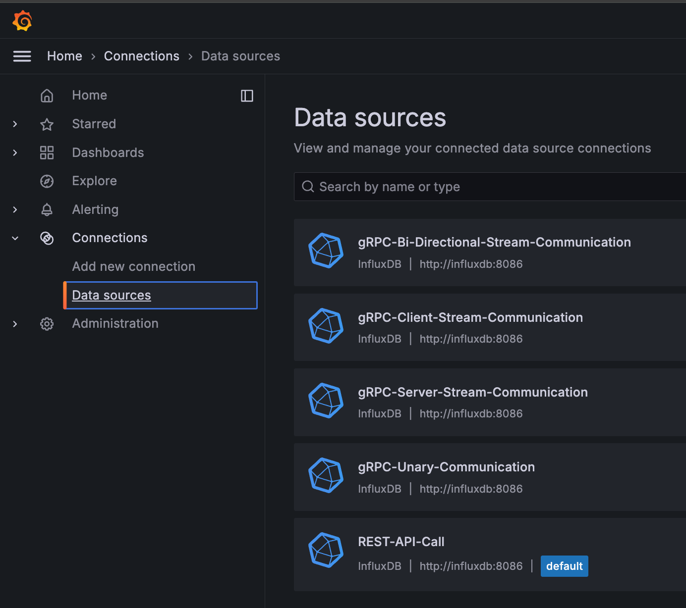
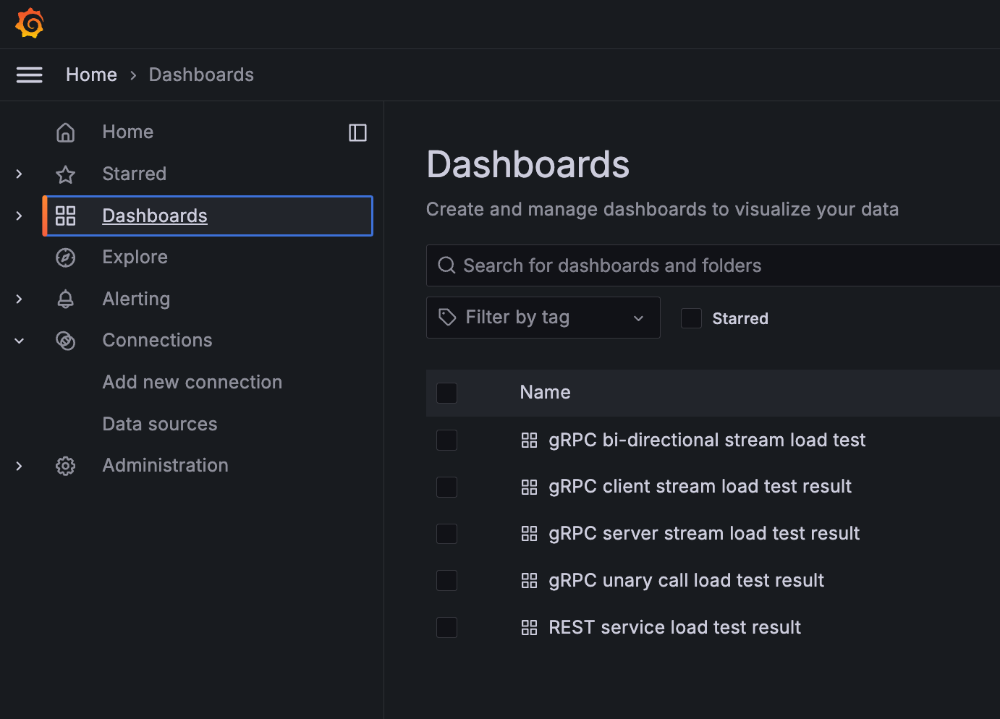

# Benchmark REST API and gRPC - Stress test

## Diagram



## Benchmark Test Assumption

1. User ranges through `from` and `to`.

2. Entrypoint server traverses `from` to `to` and sends each number to the destination server.

3. Destination server returns an additional number by squaring each number from 1 to the number it received.

4. Entrypoint server returns all the response values after they are placed in the array

## REST API endpoints

<details>
<summary>Endpoint list for benchmark</summary>

- `/rest`: Request to REST API ser

  - Query

    - `from`: Should bigger than 0, `required`
    - `to`: Should bigger than 0, `required`

  - Example

    ```bash
    127.0.0.1:8080/rest?from=1&to=100000
    ```

- `/grpc/unary`: Invoke grpc-service Unary Communication

  - Query

    - `from`: Should bigger than 0, `required`
    - `to`: Should bigger than 0, `required`

  - Example

    ```bash
    127.0.0.1:8080/grpc/unary?from=1&to=100000
    ```

- `/grpc/stream/client`: Invoke grpc-service Client-Stream Communication

  - Query

    - `from`: Should bigger than 0, `required`
    - `to`: Should bigger than 0, `required`

  - Example

    ```bash
    127.0.0.1:8080/grpc/stream/client?from=1&to=100000
    ```

- `/grpc/stream/server`: Invoke grpc-service Server-Stream Communication

  - Query

    - `from`: Should bigger than 0, `required`
    - `to`: Should bigger than 0, `required`

  - Example

    ```bash
    127.0.0.1:8080/grpc/stream/server?from=1&to=100000
    ```

- `/grpc/stream/bi`: Invoke grpc-service Bi-Directional-Stream Communication

  - Query

    - `from`: Should bigger than 0, `required`
    - `to`: Should bigger than 0, `required`

  - Example

    ```bash
    127.0.0.1:8080/grpc/stream/bi?from=1&to=100000
    ```

</details>

## Set up Benchmark Environment

<details>
<summary>Set up benchmark with docker-compose environment</summary>

### It's good to know...

- `service0`: REST API which user will send request(Benchmark entrypoint server)
- `service1`: gRPC server, communicate with `service0`. Include Unary, Client Stream, Server Stream communication.
- `service2`: REST API server, communicate with `service0`

### Start environment

1. Run `docker-compose.yaml` in root directory

   ```bash
   docker-compose up -d
   ```

2. REST API's location is `localhost:8080`. Make sure port `8080` is not in used.(You can modify port in `docker-compose.yaml`)

</details>

<details>
<summary>Set up benchmark with local Golang compile</summary>

### Make sure these dependencies to be installed

- Golang with version 1.18 or upper
- `make` utility(For makefile)
- `protoc`, which is compiler of protobuf

### Install go dependencies for `protoc` Golang plugin and update PATH

```bash
go install google.golang.org/protobuf/cmd/protoc-gen-go@latest
go install google.golang.org/grpc/cmd/protoc-gen-go-grpc@latest
export PATH="$PATH:$(go env GOPATH)/bin"
```


### Start environment

1.  Run `setup.sh`. It'll install golang dependencies

2.  Start server in following order

    1.  `grpc-service`

        ```bash
        cd grpc-service

        ./bin/server
        ```

    2.  `rest-service`

        ```bash
        cd rest-service

        ./bin/server

        ```

    3.  `user-rest-handler`

        ```bash

        cd user-rest-handler

        ./bin/server

        ```

</details>

## Setup benchmark environment and visualization

### In used

- Docker-Compose environment
- Stress test tool: Grafana Lab K6
- Visualization: Grafana
- TSDB: Influx DB

### Provisioned

**Warning: Benchmark docker environment are fully provisioned. Unexpected modifications can ruin an existing provisioned environment.**

<details>
<summary>If you first initialize grafana docker-compose...</summary>




</details>

- Dashboard for each endpoint
- Influx DB Datasource connection

### Modify stress test code

Currently, only the most basic stress test codes are written in this repository. If you want to change the stress test code, modify k6 scripts located in `benchmark/script/**/*.k6.js` files. I recommend to run load test with `**/start.sh`, for grafana visualization.
